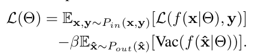
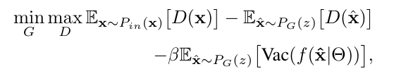

# Multidimensional Uncertainty-Aware Evidential Neural Networks

<em>This document is a review of the paper: <a href="https://arxiv.org/abs/2012.13676">https://arxiv.org/abs/2012.13676</a></em>

---

## 🆕 What is new in this work?

- Proposes a novel uncertainty-aware evidential neural network (WGAN-ENN) for OOD (Out-of-Distribution) detection.
- Combines Wasserstein Generative Adversarial Network (WGAN) with Evidential Neural Networks (ENNs) for joint training.

---

## ❓ Why is the work important?

- Demonstrates that vacuity can distinguish boundary samples from OOD samples.
- The proposed model with vacuity regularization can generate and utilize various types of OOD samples.
- Achieves state-of-the-art performance in both uncertainty estimation and OOD detection benchmarks.

---

## 📚 What is the literature gap?

- Traditional ENNs model the uncertainty of class probabilities, but are trained as a **black box** without considering different types of uncertainty in data.
- This often results in overconfidence in OOD tests and difficulty distinguishing boundary samples.
    - Sensoy's ENN measures uncertainty only by the entropy of predicted probabilities (due to using cross-entropy loss), so it cannot distinguish the causes of uncertainty.
    - This leads to overconfidence in OOD detection and makes it difficult to distinguish between boundary and OOD samples.
- Regularization methods using hand-picked auxiliary OOD samples have been proposed, but require many OOD samples.

---

## 🛠️ How is the gap filled?

- WGAN and ENNs are combined for joint training.
- New objective functions are proposed for both ENNs and WGAN, explicitly considering vacuity (unlike traditional ENNs).

**ENN Loss:**
> First term: traditional ENN loss; Second term: vacuity regularization

    

**WGAN Loss:**
> Last term encourages generator to produce OOD samples with high vacuity uncertainty

    

---

## 🏆 What is achieved with the new method?

- WENN using vacuity outperforms other methods in OOD uncertainty estimation.

---

## 🗂️ What data are used?

- Image datasets: MNIST, CIFAR, notMNIST, etc.

---

## ⚠️ What are the limitations?

- The proposed loss explicitly considers vacuity, but not dissonance.
- Experiments show WENN outputs good dissonance, but it is unclear how much dissonance would be derived by other methods compared to WENN in this paper.

    Made with ❤️ by Katito1014 | Last updated: August 9, 2025

