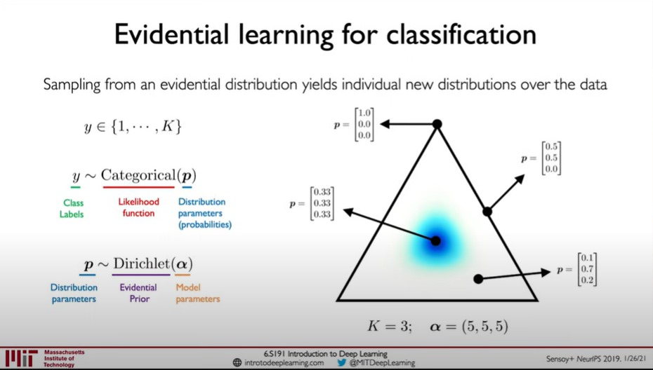

# Evidential-DeepLearning-Review

 * ### Common Terms of Uncertainty Categories

    * #### Epistemic Uncertainties

        Epistemic uncertainty is also known as model uncertainty, which stems from insufficient knowledge or limited data.

        High epistemic uncertainty means model doesn't possess enough information to make a reliable prediction for a given sample.

        Epistemic uncertainty can be reduced by gathering more data, enhancing the model.

    * #### Aleatoric Uncertainty

        Aleatoric uncertainty or data uncertainty is inherent to the nature of the training data itself.

        Aleatoric uncertainty requires more careful consideration of data's inherent properties to reduce.

    * #### Vacuity and Dissonance

        Vacuity is uncertainty arising from a lack of information, often same with epistmeic uncertainty.
    
        Dissonance is uncertainty occured when a model gives inconsistent predictions based on different parts or features of a particular sample.

* ### Theoretical Foundations of EDL
    * #### Introduction of Subjective Logic (SL)
        
        We are familiar with the probabilistic logic that can take a probability value in the range [0,1], reflecting a degree of subjectivity by allowing the argument to be partially true.

        Subjective Logic extends this by including not only belief and disbelief (probability) but also uncertainty.

        For example, given a categorical random variable X in domain **X**, subjective opinion in SL can be formalized as an ordered triplet $\tau$ = (*b*,*u*,*a*), where *b* is belief mass, *u* is uncertainty mass, *a* is base rate.

         

        When domain **X** is binary, the opinion is a binomial opinion, or when it has more than two elements, opinion is multinomial opinion.

        There is a generalized form of binomial / multinomial opinions. X is hypervariable that includes power set of domain **X** excluding the empty set and the set **X** itself.
        
        For example, the possibility that Cat or Dog will be answer is 0.7 => P(Cat,Dog) = 0.7

        If all belief masses are assigned to singleton classes (P(Cat),P(Dog)) then hypernmoial opinion is same with multinomial opinion.

           

        Since uncertainty mass can be interpreted as belief mass assigned to whole domain, SL can naturally assign uncertainty mass *u* to each element according to base rate *a*.

        **The well defined projected probability** is defined as:

        $$P_i = b_i + a_iu_i$$

        **Interpretation**: Model got belief *b* from data, and it had prior *a* which means probability that certain label could happen, when it has high prior, the more probability is assigned by multiplication with uncertainty *u*.
        
         

        With above definition, SL theory identifies a **bijection** between a multinomial opinion and a Dirichlet probability density function (PDF).

        Then, given the base rate *a*, there exists a **bijection** F between opinion $\tau$ and the Dirichelt PDF Dir(*p*,$\alpha$), where $\alpha$ satisfies $\alpha_i$ = $b_iW/u + a_iW$, W is positive prior weight.         
        
        **Interpretation** : If opinion $\tau$ is known (*a*, *b*, *u* are known), then $\alpha$ is assigned to only one value by bijection F and vice verca is same.

        This relationship came from the interpretation of second-order uncertainty thorough probability density(Dirichlet Distribution) and is crucial because it faciliates calculus reasoning using PDFs.   
    *   **Quenstion** :    
        * First-order uncertainty : The probability that we are familiar with. $p(rain)$ = 0.7 
         
        * Second-order uncertainty : Model probability with PDF expressing uncertainty. 
        
        
    

