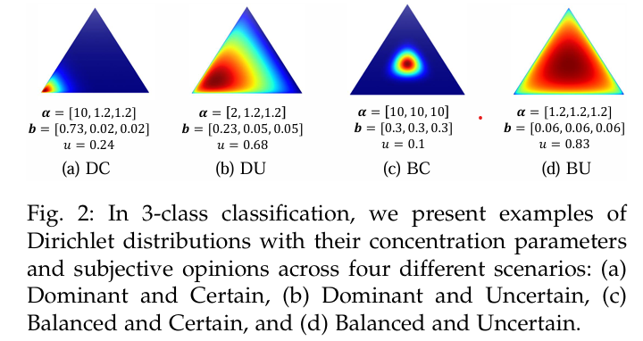
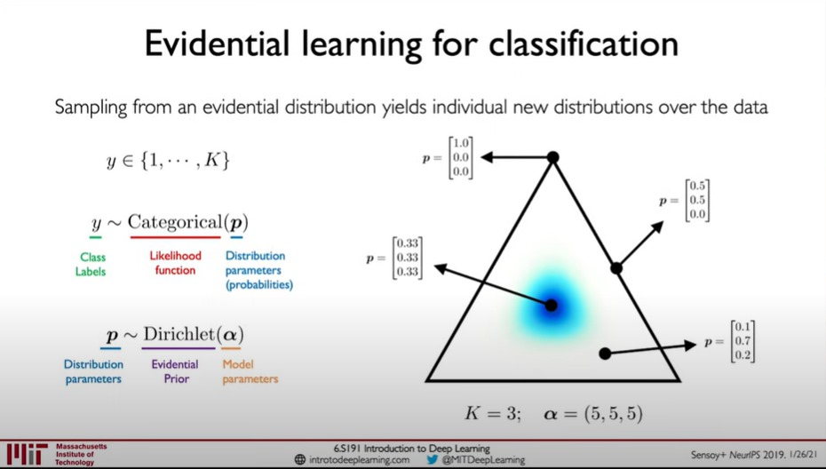

  
    
  
    <h1>Evidential Deep Learning Review</h1>
    
<em>Comprehensive summary and notes based on <a href="https://arxiv.org/abs/2409.04720">A Comprehensive Survey on Evidential Deep Learning and Its Applications</a></em>

---

## 📚 Common Terms of Uncertainty Categories

### 🧠 Epistemic Uncertainties
> *Epistemic uncertainty* (model uncertainty) stems from insufficient knowledge or limited data. High epistemic uncertainty means the model lacks enough information to make a reliable prediction. It can be reduced by gathering more data or improving the model.

### 🎲 Aleatoric Uncertainty
> *Aleatoric uncertainty* (data uncertainty) is inherent to the nature of the data itself, such as statistical randomness or noise. It cannot be reduced by collecting more data, only by better modeling the data's inherent properties.

### 🌀 Vacuity and Dissonance
In **Subjective Logic (SL)**:
* **Vacuity**: Uncertainty from lack of evidence (similar to epistemic uncertainty, but not identical).
* **Dissonance**: Uncertainty from inconsistent predictions due to insufficient evidence, leading to *inconclusiveness* in decision making.

---

## 🏛️ Theoretical Foundations of EDL

### 🔹 Introduction to Subjective Logic (SL)

Subjective Logic extends probabilistic logic by including not only belief and disbelief (probability), but also *uncertainty*.

* **Subjective opinion** in SL: $\tau = (b, u, a)$
    * $b$: belief mass
    * $u$: uncertainty mass
    * $a$: base rate

* **Binomial/Multinomial/Hypernomial opinions**: Depending on the domain size and how belief is distributed.
* If all belief is assigned to singleton classes, hypernomial = multinomial opinion.

**Projected probability:**

$$P_i = b_i + a_i u_i$$

> Model gets belief $b$ from data, and prior $a$ (probability of a label occurring). High prior increases probability via uncertainty $u$.

---

#### 🔸 Dirichlet Distribution & Bijection

* SL theory identifies a **bijection** between a multinomial opinion and a Dirichlet PDF.
* Given base rate $a$, there is a bijection $F$ between opinion $\tau$ and Dirichlet PDF Dir($p$, $\alpha$), where $\alpha_i = b_i W/u + a_i W$ ($W$: positive prior weight).
* This enables calculus reasoning using PDFs and expresses **second-order uncertainty**.

**First-order uncertainty**: $p(rain) = 0.7$  
**Second-order uncertainty**: Probability modeled as a PDF (Dirichlet) expressing uncertainty.

    
     
    <em>Heatmap: Dirichlet distribution and subjective opinion</em>

    
    <em>Examples: Various distributions with different parameters, belief, uncertainty</em>

---

## 🔄 Other Uncertainty Reasoning Frameworks

### 📊 Dempster-Shafer Theory (DST)
* DST challenges the additivity principle of probability theory.
* Allows the sum of probabilities for all mutually exclusive events to be less than one.
* Both SL and DST can allocate belief mass to the entire domain (expressing uncertainty).
* **Key difference:** SL has a flexible prior distribution that allocates uncertainty to each class; DST does not.

### 📈 Imprecise Dirichlet Model (IDM)
* **SL:** Base rate $a$ is set to one value; probability is a single value.
* **IDM:** Probability is a range, with base rate $a$ varying from minimum (0) to maximum (1).

---

    Made with ❤️ by Katito1014 | Last updated: August 9, 2025

    

